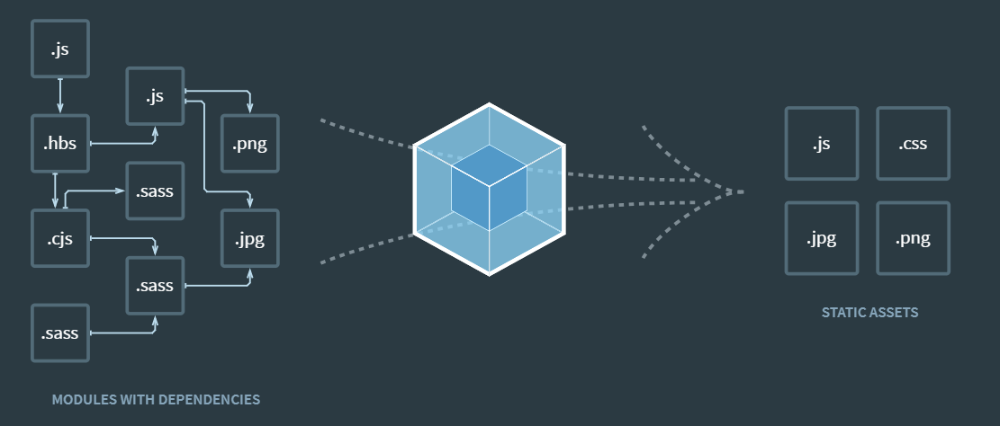

--------------------------------------------------------------------------------
<h1>Seção 01 - Introdução</h1>

* Foram feitas as instalações do MongoDB, NodeJS, Cmder e VSCode como editor.
* Para executar o MongoDB é necessário colocar o diretório /bin do mongo db nas variáveis de ambiente (windows), e criar os diretórios data/db na raiz do sistema.

----------------------------------------------------------------------------------
<h1>Seção 02 - Webpack</h1>

<h2>Visão Geral e Instalação</h2>

* O Webpack é um bundler de módulo JavaScript de código aberto. O Webpack utiliza módulos com dependências e gera ativos estáticos representando esses módulos.



* O comando "npm init -y" cria o arquivo package.json, que é como o descritor do nosso projeto que irá executar as dependencias para o node.

* Instalar a dependencia do webpack e do webpack-dev-server
npm i --save-dev webpack@1.14.0 webpack-dev-server@1.16.2

<h2>Testando a configuração</h2>

```json
{
  
"name": "exercicios_webpack",
  
"version": "1.0.0",
  
"description": "",
  
"main": "index.js",
  
"scripts": {
    "dev": "webpack-dev-server --progress --colors --inline --hot"
  },
  "keywords": [],
  "author": "",
  "license": "ISC",
  "devDependencies": {
    "webpack": "^1.14.0",
    "webpack-dev-server": "^1.16.2"
  }
}


```
* O atributo scripts serve para inserir comando no npm para que sejam executados
	* --progress: mostra o progresso
	* --colors: colorido
	* --inline: 
	* --hot: sempre quando fizer uma atualização ele atualiza ligado

* npm run dev

<h2>Usando o Sistema de Módulos do CommonsJS</h2>

index.js
```js
const logger = require('./logger') // PONTO (.) PARA REFERÊNCIAR ARQUIVOS FORA DO DIRETÓRIO node_modules

logger.info('Usando o padrão CommonsJS');

```

logger.js
```js
function info(text){
    console.log(`INFO: ${text}`);
}

//module.exports = {info : info}
module.exports = { info } // ECMAScript 6 - ELE PEGA O VALOR E A KEY DO OBJETO

```

<h2>Importância da referência</h2>
* Para gerar o arquivo bundle.js é apenas necessário executar o .\node_modules\.bin\webpack
* O arquivo bundle.js sempre irá pegar os arquivos que estão sendo referênciados a partir do index.js.


<h2>Usando EcmaScript 2015 sem o Babel</h2>

```js
export default class Pessoa {

    constructor(nome) {
        this.nome = nome;
    }

    toString() {
        return `Pessoa: ${this.nome}`;
    }

}


import Pessoa from './pessoa';

const pessoa = new Pessoa('Gustavo');
console.log(pessoa.toString());
```

* Sem o Babel, o navegador não irá compreender a sintaxe import e export, por conta disso um transpiler é necessário (Babel).

<h2>Usando o Sistema de Módulos do ES2015 (Babel)</h2>

* No webpack.config.js

```js
const webpack = require('webpack')

//OBJETO QUE REPRESENTA TODA CONFIGURAÇÃO
//QUE QUEREMOS NA APLICAÇÃO
//FAZER TRANSPILE JAVASCRIPT, REACT, IRÁ ESTAR AQUI
//É NECESSÁRIO CRIAR O DIRETÓRIO ex PARA COLOCAR O ARQUIVO index.js
module.exports = {
    entry : './ex/index.js',
    output : {
        path: __dirname + '/public',
        filename: './bundle.js'
    },
    devServer: {
        port: 8080,
        contentBase: './public'
    },
    module: {
        loaders: [{
            test: /.js:$/,
            loader: 'babel-loarder',
            exclude: /node_modules/,
            query: {
                presets: ['es2015']
            }
        }]
    }
}
```
